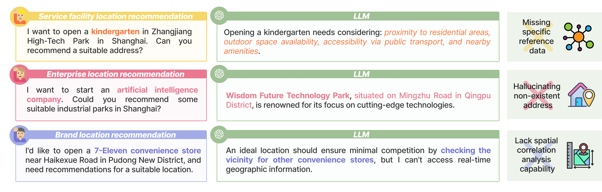
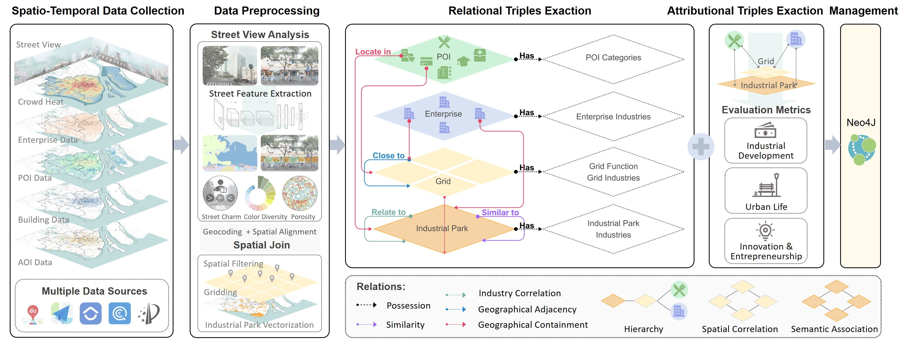
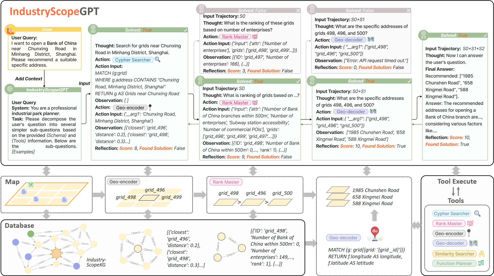

<div align="center" style="font-family: charter;">
  <h1>Decoding Urban Industrial Complexity:<br>Enhancing Knowledge-Driven Insights via IndustryScopeGPT</h1>

<p align="center">
    <a href="https://dl.acm.org/doi/abs/10.1145/3664647.3681705">
        </a>
    <a href="https://arxiv.org/abs/xxx">
        </a>
    <a href="https://www.youtube.com/watch?v=5X-Il5Ndkao&t=1661s">
        </a>        
         
</p>




</div>


----

## ✏️ Hightlights
- 🎯 **Top Open-Source Urban Knowledge Graph Dataset**
  
IndustryScopeKG is the first and largest open-source, multimodal large-scale knowledge graph dataset. It integrates geospatial data such as street view images, points of interest, and crowd activities, along with socio-economic data including company information, real estate prices, and population statistics. The dataset contains 2,232,037 entities and 51,684,939 triples.
<p align="center">

</p>

- 🎯 **First Application of LLM in Industrial Park Planning and Operations**

The IndustryScopeGPT framework was developed to enhance the planning, action, and reasoning capabilities of large language models (LLMs) in industrial park planning and operations. This framework represents the first integration of large language models with spatial computing and dynamic reasoning on graph databases that incorporate external geospatial data, marking the first exploration of such applications in industrial park planning and operations.
<p align="center">

</p>

## 📰 Updates
- **`2024/10/28`**  We’re thrilled to share that our work, [Decoding Urban Industrial Complexity: Enhancing Knowledge-Driven Insights via IndustryScopeGPT](https://dl.acm.org/doi/abs/10.1145/3664647.3681705), has been published by the ACM MM 2024 conference. We are profoundly grateful for the contributions of all the contributors to this work！
- **`2024/07/23`**  We are honored to share and present our work at the [MIT Media Lab-City Science Lab Community Meeting](https://www.youtube.com/watch?v=5X-Il5Ndkao&t=1661s). For more details, please visit the City Science Lab website: [Design and Data-Driven Hybrid Community Building](https://www.media.mit.edu/events/design-and-data-driven-hybrid-community-building-city-science-lab-shanghai/).

## 🔗 IndustryscopeKG Data

The **raw data** is available for download from **[Kaggle](your-kaggle-link)**.

For seamless integration, we recommend using **Neo4j** to analyze and interact with the knowledge graph.

---

## 🛠️ Getting Started with Neo4j

We provide a **Neo4j Docker Image** to simplify the process of setting up and working with the IndustryScopeKG dataset.

### Step 1: Install Docker

Ensure you have Docker installed on your system. For installation instructions, visit [Docker's official website](https://www.docker.com/).

### Step 2: Start Neo4j with IndustryScopeKG

Run the following command to start a Neo4j container with the dataset preloaded:

```bash
docker run -d \
  --name industryscope-neo4j \
  -p 7474:7474 -p 7687:7687 \
  -e NEO4J_AUTH=neo4j/password \
  -v /path/to/your/induscopekg-data:/data \
  neo4j:latest
```

Replace ```/path/to/your/induscopekg-data``` with the path to the directory containing the dataset.

**Default credentials**:
- **Username**: `neo4j`
- **Password**: `password` (you can customize this in the `NEO4J_AUTH` variable).


### Step 3: Access Neo4j

1. Open your browser and navigate to: [http://localhost:7474](http://localhost:7474).
2. Login with the credentials you set (`neo4j/password`).


### Step 4: Import IndustryScopeKG into Neo4j (If needed)

Run the following Cypher commands in the Neo4j browser to load the dataset:

```cypher
LOAD CSV WITH HEADERS FROM 'file:///path/to/your/induscopekg-data.csv' AS row
CREATE (e:Entity {id: row.entity_id, name: row.entity_name, type: row.entity_type})
```

Replace the file path (```file:///path/to/your/induscopekg-data.csv```) with the actual location of your dataset CSV file.

### 🌰 Example Queries
Here are some useful Cypher queries you can play with:

Question 1: 静安区的所有产业园区都有哪些？  
```
MATCH (p:park) 
WHERE p.所属区县 = "静安区"
RETURN p.名称 AS 园区名称
```
Question 2: 上海张江高科技园内的网格根据零售服务POI数量的排序是什么？ 

```
MATCH (p:park {{名称: "上海张江高科技园区"}})-[:IS_IN]-(f:fishnet)
RETURN p.fishnet AS FishnetID, f.零售服务POI数量 AS RetailServicesCount
ORDER BY RetailServicesCount DESC
```

Question 3: 朕天总部经济工业园里有没有便利店？

```
MATCH (poi:poi_retail)-[:IS_IN]->(:park {{名称: '朕天总部经济工业园'}})
WHERE poi.类别 CONTAINS '便利店' OR poi.类别 CONTAINS '零售' OR poi.类别 CONTAINS '便民商店'
RETURN COUNT(poi) AS 便利店数量
```

Question 4: 张江高新区杨浦园里有几家华润？

```
MATCH (poi)-[:IS_IN]->(:park {{名称: '张江高新区杨浦园'}})
WHERE poi.名称 CONTAINS '华润'
RETURN COUNT(poi) AS 华润数量
```

Question 5: 张江高新区杨浦园里的华润名称是什么？

```
MATCH (poi)-[:IS_IN]->(:park{{名称: '张江高新区杨浦园'}})
WHERE poi.名称 CONTAINS '华润'
RETURN poi.名称 AS 华润名称
```


### 📈 Key Statistics

Table 1: The Statistics of Entities in IndustryScopeKG

| **Basic Statistics**        | **Industrial Park** | **Grid** | **Grid Dominant Function** | **POI**   | **Enterprise** | **Total**   |
|-----------------------------|---------------------|----------|---------------------------|-----------|----------------|-------------|
| **Count**                   | 264                 | 128,866  | 15                        | 112,931   | 1,058,656      | 1,300,732   |
| **(Leading) Industries**    | **Primary**         | **Secondary** | **Tertiary**          | **Scope of Operations** | **Planned** |             |
| **Industrial Park**         | 202                 | 258      | 261                      | 261       | 70             | 1,052       |
| **Grid**                    | 1,142               | 6,270    | 10,281                   | 20,246    | /              | 37,939      |
| **Enterprise**              | 18                  | 90       | 392                      | 891,814   | /              | 892,314     |

---

Table 2: The Statistics of Triples in IndustryScopeKG

| **Relation**    | **Head & Tail Entity**                                                                                                      | **Triple Records** |
|------------------|---------------------------------------------------------------------------------------------------------------------------|--------------------|
| **Locate in**    | (POI, Grid), (Enterprise, Grid), (POI, Industrial Park), (Enterprise, Industrial Park), (Grid, Industrial Park)           | 2,516,160          |
| **Adjacent to**  | (Grid, Grid), (Industrial Park, Industrial Park)                                                                          | 488,401            |
| **Similar to**   | (Industrial Park, Industrial Park)                                                                                       | 3,765              |
| **Related to**   | (Industrial Park, Industrial Park)                                                                                       | 10,687             |
| **Has**          | E.g., (Industrial Park, Planned Industries), (Grid, Leading Scope of Operations), (Grid, Dominant Functions)             | 4,252,341          |
| **Attribution**  | (Industrial Park, Value) with 111 attributions, (Grid, Value) with 82 attributions, (POI, Value) including 15 attributions, (Enterprise, Value) with 36 attributions | 44,413,585         |

### 🌟 Usage Notes
The dataset can be used standalone or integrated into your projects. It works particularly well with graph-based reasoning frameworks.
For LLM-based planning and operations, the dataset complements the IndustryScopeGPT framework, providing a dynamic and insightful environment for urban and industrial research.


---

## 🤖 IndustryscopeGPT

### Model Inference
IndustryscopeGPT scripts will be available soon under the folder ```scripts```

---

## 🤗 Citation 

If our work sparks your interest or helps your research, a little cite would mean a lot!

```bibtex
@inproceedings{10.1145/3664647.3681705,
author = {Wang, Siqi and Liang, Chao and Gao, Yunfan and Liu, Yang and Li, Jing and Wang, Haofen},
title = {Decoding Urban Industrial Complexity: Enhancing Knowledge-Driven Insights via IndustryScopeGPT},
year = {2024},
isbn = {9798400706868},
publisher = {Association for Computing Machinery},
address = {New York, NY, USA},
url = {https://doi.org/10.1145/3664647.3681705},
doi = {10.1145/3664647.3681705},
abstract = {Industrial parks are critical to urban economic growth. Yet, their development often encounters challenges stemming from imbalances between industrial requirements and urban services, underscoring the need for strategic planning and operations. This paper introduces IndustryScopeKG, a pioneering large-scale multi-modal, multi-level industrial park knowledge graph, which integrates diverse urban data including street views, corporate, socio-economic, and geospatial information, capturing the complex relationships and semantics within industrial parks. Alongside this, we present the IndustryScopeGPT framework, which leverages Large Language Models (LLMs) with Monte Carlo Tree Search to enhance tool-augmented reasoning and decision-making in Industrial Park Planning and Operation (IPPO). Our work significantly improves site recommendation and functional planning, demonstrating the potential of combining LLMs with structured datasets to advance industrial park management. This approach sets a new benchmark for intelligent IPPO research and lays a robust foundation for advancing urban industrial development. The dataset and related code are available at https://github.com/Tongji-KGLLM/IndustryScope.},
booktitle = {Proceedings of the 32nd ACM International Conference on Multimedia},
pages = {4757–4765},
numpages = {9},
keywords = {industrial park planning and operation, large language model agent, urban design and planning, urban knowledge graph},
location = {Melbourne VIC, Australia},
series = {MM '24}
}


```


